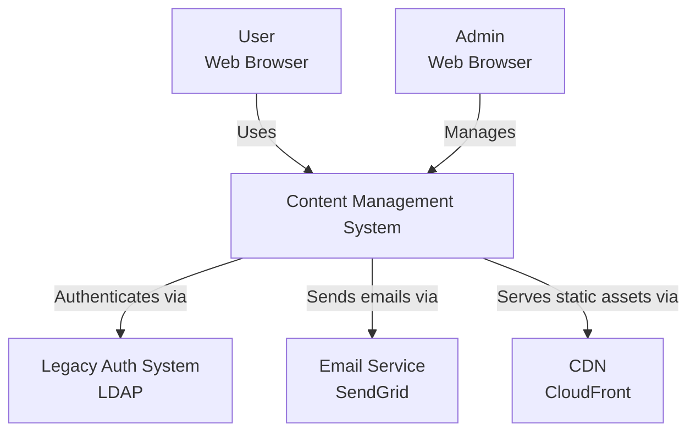
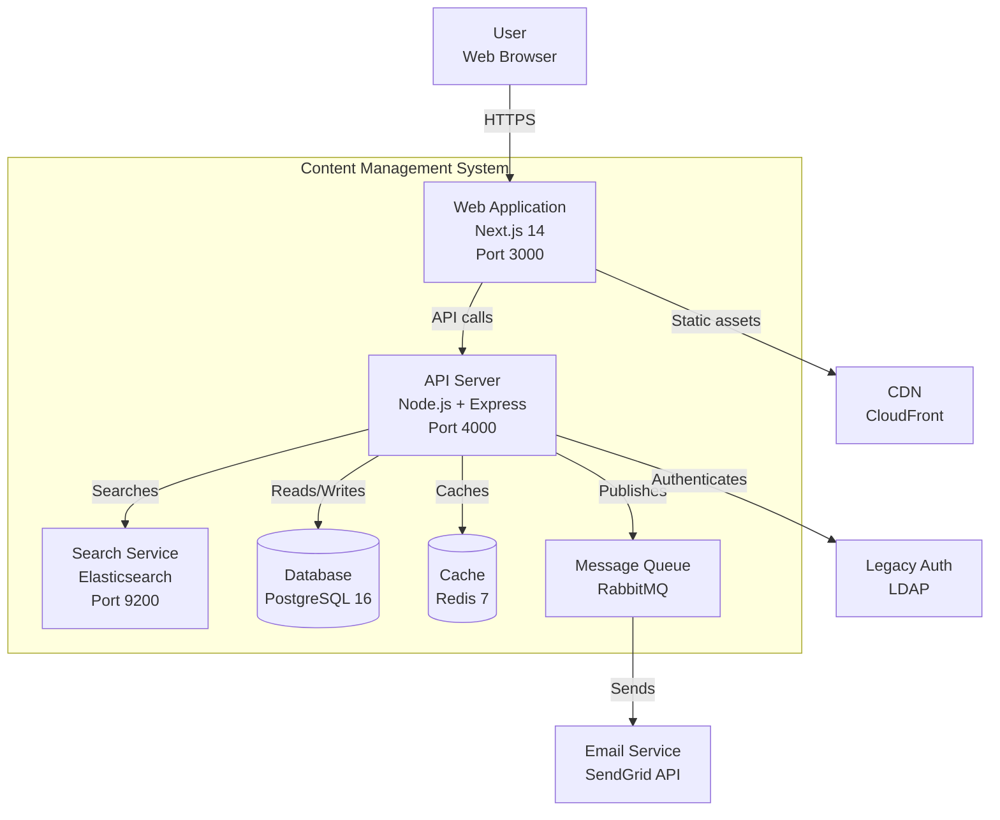
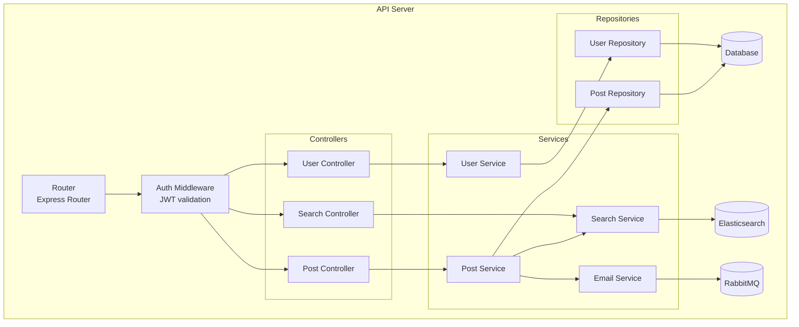
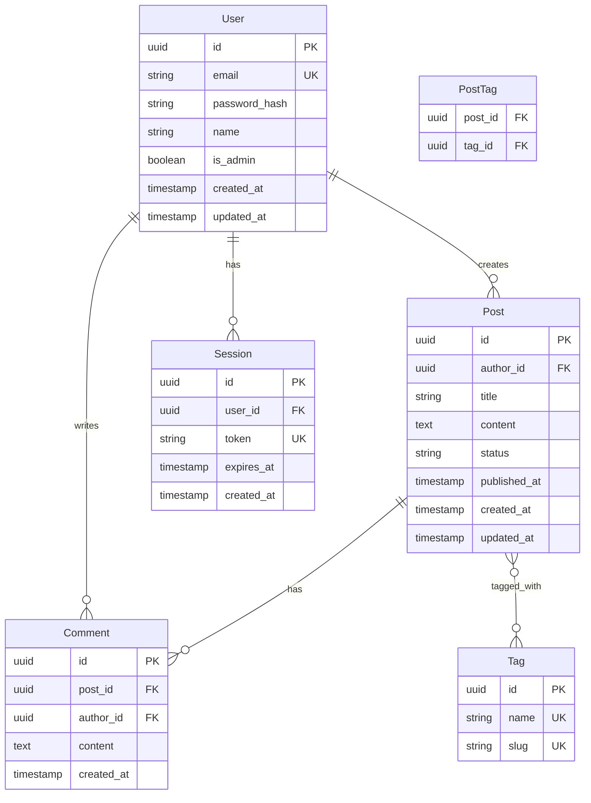

# Architecture Blueprint

## Overview

Create a comprehensive architecture blueprint before building. The blueprint is the technical foundation that guides all implementation decisions.

**A good architecture blueprint includes:**
- **C4 Diagrams** - Context, Container, Component, Code views
- **ADRs** - Architecture Decision Records documenting key choices
- **Technology Radar** - Adopted, Trial, Assess, Hold technologies
- **Dependency Graph** - Service and module dependencies
- **Deployment Topology** - Infrastructure and deployment architecture
- **Data Flow** - How data moves through the system
- **Security Model** - Trust boundaries and security controls
- **Scalability Plan** - How the system scales

## When to Use

**Always use when:**
- Starting a new project or major feature
- Making significant architectural changes
- Introducing new technologies or patterns
- Designing distributed systems
- Planning microservices architecture
- Migrating legacy systems
- Preparing for scale

**Use before:**
- Writing any code
- Creating detailed specs
- Estimating timelines
- Allocating resources

## The 5-Phase Blueprint Process

```
┌─────────────────────────────────────────────────────────┐
│           ARCHITECTURE BLUEPRINT WORKFLOW                │
└─────────────────────────────────────────────────────────┘

    ┌──────────────┐
    │   PHASE 1    │  Understand Requirements
    │  UNDERSTAND  │  - Functional requirements
    │ REQUIREMENTS │  - Non-functional requirements
    └──────┬───────┘  - Constraints
           │
           ▼
    ┌──────────────┐
    │   PHASE 2    │  Design Architecture
    │   DESIGN     │  - C4 diagrams
    │ ARCHITECTURE │  - Component design
    └──────┬───────┘  - Data model
           │
           ▼
    ┌──────────────┐
    │   PHASE 3    │  Document Decisions
    │  DOCUMENT    │  - ADRs
    │  DECISIONS   │  - Technology choices
    └──────┬───────┘  - Trade-offs
           │
           ▼
    ┌──────────────┐
    │   PHASE 4    │  Validate Design
    │  VALIDATE    │  - Review with stakeholders
    │    DESIGN    │  - Threat modeling
    └──────┬───────┘  - Performance analysis
           │
           ▼
    ┌──────────────┐
    │   PHASE 5    │  Create Roadmap
    │   CREATE     │  - Implementation phases
    │   ROADMAP    │  - Dependencies
    └──────────────┘  - Milestones
```

## Phase 1: Understand Requirements

### Step 1.1: Gather Functional Requirements

**What the system must do:**

```markdown
## Functional Requirements

### User Management
- Users can sign up with email/password
- Users can log in and log out
- Users can reset forgotten passwords
- Users can update their profile
- Admins can manage user accounts

### Content Management
- Users can create, read, update, delete posts
- Posts support markdown formatting
- Posts can have tags and categories
- Posts can be published or drafted
- Posts have revision history

### Search
- Full-text search across posts
- Filter by tags, categories, author
- Sort by date, relevance, popularity
- Autocomplete suggestions
```

### Step 1.2: Gather Non-Functional Requirements

**How the system must perform:**

```markdown
## Non-Functional Requirements

### Performance
- Page load time < 2 seconds (p95)
- API response time < 200ms (p95)
- Search results < 500ms (p95)
- Support 10,000 concurrent users
- Handle 1,000 requests/second

### Scalability
- Horizontal scaling for web tier
- Database read replicas
- CDN for static assets
- Auto-scaling based on load

### Availability
- 99.9% uptime (8.76 hours downtime/year)
- Zero-downtime deployments
- Automated failover
- Multi-region deployment

### Security
- HTTPS everywhere
- OWASP Top 10 compliance
- Data encryption at rest
- Regular security audits
- GDPR compliance

### Maintainability
- Comprehensive test coverage (>80%)
- Automated CI/CD pipeline
- Infrastructure as code
- Monitoring and alerting
- Documentation

### Observability
- Distributed tracing
- Centralized logging
- Metrics and dashboards
- Error tracking
- Performance monitoring
```

### Step 1.3: Identify Constraints

**What limits our choices:**

```markdown
## Constraints

### Technical Constraints
- Must use existing PostgreSQL database
- Must integrate with legacy authentication system
- Must support IE11 (corporate requirement)
- Must run on AWS (company standard)

### Business Constraints
- Budget: $50,000 for infrastructure (first year)
- Timeline: 6 months to MVP
- Team: 3 developers, 1 designer, 1 PM
- Compliance: SOC2, GDPR, HIPAA

### Organizational Constraints
- Must use company-approved technologies
- Must follow company security policies
- Must integrate with existing monitoring
- Must use company CI/CD pipeline
```

## Phase 2: Design Architecture

### Step 2.1: Create C4 Diagrams

**Level 1: System Context**

Shows how the system fits into the world.

```markdown
## C4 Level 1: System Context



**Key:**
- **Users** - Content creators and readers
- **Admins** - System administrators
- **CMS** - Our system (the thing we're building)
- **Legacy Auth** - Existing authentication system (constraint)
- **Email Service** - Third-party email delivery
- **CDN** - Content delivery network
```

---

**Level 2: Container Diagram**

Shows the high-level technology choices.

```markdown
## C4 Level 2: Container Diagram



**Technology Choices:**
- **Web**: Next.js 14 (React framework, SSR, API routes)
- **API**: Node.js + Express (REST API, business logic)
- **Database**: PostgreSQL 16 (relational data, ACID)
- **Cache**: Redis 7 (session storage, query cache)
- **Search**: Elasticsearch (full-text search)
- **Queue**: RabbitMQ (async tasks, email sending)
- **CDN**: CloudFront (static assets, images)
```

---

**Level 3: Component Diagram**

Shows the internal structure of a container.

```markdown
## C4 Level 3: Component Diagram (API Server)



**Component Responsibilities:**
- **Router**: Route HTTP requests to controllers
- **Auth Middleware**: Validate JWT tokens, check permissions
- **Controllers**: Handle HTTP requests/responses, validation
- **Services**: Business logic, orchestration
- **Repositories**: Data access, queries
```

---

**Level 4: Code Diagram**

Shows the class/module structure (optional, for complex components).

```markdown
## C4 Level 4: Code Diagram (Post Service)

```typescript
// Domain Model
interface Post {
  id: string;
  title: string;
  content: string;
  authorId: string;
  status: 'draft' | 'published';
  tags: string[];
  createdAt: Date;
  updatedAt: Date;
}

// Repository Interface
interface PostRepository {
  findById(id: string): Promise<Post | null>;
  findByAuthor(authorId: string): Promise<Post[]>;
  create(post: Omit<Post, 'id'>): Promise<Post>;
  update(id: string, post: Partial<Post>): Promise<Post>;
  delete(id: string): Promise<void>;
}

// Service
class PostService {
  constructor(
    private postRepo: PostRepository,
    private searchService: SearchService,
    private emailService: EmailService
  ) {}

  async createPost(authorId: string, data: CreatePostDTO): Promise<Post> {
    // Validate
    const validated = CreatePostSchema.parse(data);
    
    // Create
    const post = await this.postRepo.create({
      ...validated,
      authorId,
      status: 'draft',
      createdAt: new Date(),
      updatedAt: new Date()
    });
    
    // Index for search
    await this.searchService.indexPost(post);
    
    return post;
  }

  async publishPost(postId: string, authorId: string): Promise<Post> {
    // Verify ownership
    const post = await this.postRepo.findById(postId);
    if (!post || post.authorId !== authorId) {
      throw new ForbiddenError();
    }
    
    // Update status
    const published = await this.postRepo.update(postId, {
      status: 'published',
      updatedAt: new Date()
    });
    
    // Notify subscribers
    await this.emailService.notifySubscribers(published);
    
    return published;
  }
}
```
```

### Step 2.2: Design Data Model

**Entity-Relationship Diagram:**

```markdown
## Data Model



**Schema (PostgreSQL):**
```sql
CREATE TABLE users (
  id UUID PRIMARY KEY DEFAULT gen_random_uuid(),
  email VARCHAR(255) UNIQUE NOT NULL,
  password_hash VARCHAR(255) NOT NULL,
  name VARCHAR(255) NOT NULL,
  is_admin BOOLEAN DEFAULT FALSE,
  created_at TIMESTAMP DEFAULT NOW(),
  updated_at TIMESTAMP DEFAULT NOW()
);

CREATE INDEX idx_users_email ON users(email);

CREATE TABLE posts (
  id UUID PRIMARY KEY DEFAULT gen_random_uuid(),
  author_id UUID NOT NULL REFERENCES users(id) ON DELETE CASCADE,
  title VARCHAR(500) NOT NULL,
  content TEXT NOT NULL,
  status VARCHAR(20) DEFAULT 'draft',
  published_at TIMESTAMP,
  created_at TIMESTAMP DEFAULT NOW(),
  updated_at TIMESTAMP DEFAULT NOW()
);

CREATE INDEX idx_posts_author ON posts(author_id);
CREATE INDEX idx_posts_status ON posts(status);
CREATE INDEX idx_posts_published ON posts(published_at DESC);

-- ... more tables
```
```

### Step 2.3: Design API

**REST API Specification:**

```markdown
## API Design

### Authentication
All endpoints except `/auth/login` and `/auth/signup` require authentication via JWT token in `Authorization: Bearer <token>` header.

### Endpoints

#### Authentication
```
POST   /api/auth/signup          Create account
POST   /api/auth/login           Login
POST   /api/auth/logout          Logout
POST   /api/auth/refresh         Refresh token
POST   /api/auth/reset-password  Request password reset
```

#### Users
```
GET    /api/users/:id            Get user profile
PUT    /api/users/:id            Update user profile
DELETE /api/users/:id            Delete user account
GET    /api/users/:id/posts      Get user's posts
```

#### Posts
```
GET    /api/posts                List posts (paginated)
POST   /api/posts                Create post
GET    /api/posts/:id            Get post
PUT    /api/posts/:id            Update post
DELETE /api/posts/:id            Delete post
POST   /api/posts/:id/publish    Publish post
```

#### Search
```
GET    /api/search?q=query       Search posts
GET    /api/search/suggest?q=    Autocomplete suggestions
```

### Example Request/Response

**POST /api/posts**
```json
// Request
{
  "title": "My First Post",
  "content": "# Hello World\n\nThis is my first post.",
  "tags": ["introduction", "hello"]
}

// Response (201 Created)
{
  "id": "550e8400-e29b-41d4-a716-446655440000",
  "title": "My First Post",
  "content": "# Hello World\n\nThis is my first post.",
  "authorId": "123e4567-e89b-12d3-a456-426614174000",
  "status": "draft",
  "tags": ["introduction", "hello"],
  "createdAt": "2026-05-26T00:00:00Z",
  "updatedAt": "2026-05-26T00:00:00Z"
}
```

### Error Responses
```json
// 400 Bad Request
{
  "error": "Validation failed",
  "details": [
    { "field": "title", "message": "Title is required" }
  ]
}

// 401 Unauthorized
{
  "error": "Authentication required"
}

// 403 Forbidden
{
  "error": "You don't have permission to access this resource"
}

// 404 Not Found
{
  "error": "Resource not found"
}

// 500 Internal Server Error
{
  "error": "Internal server error",
  "requestId": "req_abc123"
}
```
```

## Phase 3: Document Decisions

### Step 3.1: Write Architecture Decision Records (ADRs)

**ADR Template:**

```markdown
# ADR-001: Use PostgreSQL for Primary Database

**Status:** Accepted

**Date:** 2026-05-26

**Context:**
We need a database to store user data, posts, and comments. The system requires ACID transactions, complex queries with joins, and full-text search capabilities.

**Decision:**
We will use PostgreSQL 16 as our primary database.

**Consequences:**

**Positive:**
- ACID compliance ensures data integrity
- Rich query capabilities (joins, CTEs, window functions)
- Built-in full-text search (pg_trgm, ts_vector)
- JSON support for flexible schemas
- Mature ecosystem and tooling
- Strong community support
- Excellent performance for our scale (< 1M records)

**Negative:**
- Vertical scaling limits (though sufficient for our needs)
- More complex to operate than managed NoSQL
- Requires careful index management for performance

**Alternatives Considered:**
- **MongoDB**: Rejected due to lack of ACID transactions and complex query support
- **MySQL**: Rejected due to inferior full-text search and JSON support
- **DynamoDB**: Rejected due to query limitations and vendor lock-in

**Related Decisions:**
- ADR-002: Use Prisma as ORM
- ADR-005: Use Elasticsearch for advanced search
```

**Common ADR Topics:**
- Database choice
- Framework selection
- Authentication strategy
- Deployment platform
- API design (REST vs GraphQL)
- State management
- Testing strategy
- Monitoring solution

### Step 3.2: Create Technology Radar

**Inspired by ThoughtWorks Technology Radar:**

```markdown
## Technology Radar

### Adopt (Use with confidence)
- **Next.js 14** - React framework with SSR
- **TypeScript 5** - Type-safe JavaScript
- **PostgreSQL 16** - Primary database
- **Redis 7** - Caching and sessions
- **Vitest** - Fast unit testing
- **Playwright** - E2E testing
- **Docker** - Containerization
- **GitHub Actions** - CI/CD

### Trial (Worth pursuing, but not yet proven)
- **Elasticsearch** - Advanced search (evaluate vs PostgreSQL FTS)
- **RabbitMQ** - Message queue (evaluate vs SQS)
- **Prisma** - ORM (evaluate vs raw SQL)
- **Zod** - Schema validation

### Assess (Explore to understand potential)
- **tRPC** - Type-safe APIs (alternative to REST)
- **Turborepo** - Monorepo tooling
- **Bun** - Fast JavaScript runtime
- **Drizzle ORM** - Lightweight ORM

### Hold (Proceed with caution)
- **MongoDB** - Not suitable for our use case
- **GraphQL** - Adds complexity without clear benefit
- **Microservices** - Premature for our scale
- **Kubernetes** - Over-engineered for our needs
```

## Phase 4: Validate Design

### Step 4.1: Threat Modeling

**STRIDE Analysis:**

```markdown
## Threat Model

### Spoofing
- **Threat**: Attacker impersonates legitimate user
- **Mitigation**: JWT tokens, secure session management, MFA

### Tampering
- **Threat**: Attacker modifies data in transit or at rest
- **Mitigation**: HTTPS, database encryption, input validation

### Repudiation
- **Threat**: User denies performing an action
- **Mitigation**: Audit logging, immutable logs

### Information Disclosure
- **Threat**: Sensitive data exposed
- **Mitigation**: Encryption at rest, access controls, data masking

### Denial of Service
- **Threat**: System becomes unavailable
- **Mitigation**: Rate limiting, auto-scaling, DDoS protection

### Elevation of Privilege
- **Threat**: User gains unauthorized access
- **Mitigation**: Role-based access control, principle of least privilege
```

### Step 4.2: Performance Analysis

**Back-of-the-envelope calculations:**

```markdown
## Performance Analysis

### Traffic Estimates
- **Users**: 100,000 monthly active users
- **Requests**: 10 requests/user/day = 1M requests/day
- **Peak**: 3x average = 35 requests/second
- **Growth**: 2x per year

### Database Sizing
- **Users**: 100K users × 1KB = 100MB
- **Posts**: 1M posts × 10KB = 10GB
- **Comments**: 5M comments × 500B = 2.5GB
- **Total**: ~15GB (fits in memory for caching)

### Bandwidth
- **Average page**: 500KB (HTML + CSS + JS + images)
- **Peak traffic**: 35 req/s × 500KB = 17.5 MB/s = 140 Mbps
- **Monthly**: 1M req/day × 30 days × 500KB = 15TB/month

### Cost Estimate (AWS)
- **EC2** (2× t3.medium): $60/month
- **RDS** (db.t3.medium): $70/month
- **ElastiCache** (cache.t3.micro): $15/month
- **S3 + CloudFront**: $50/month
- **Total**: ~$200/month
```

## Phase 5: Create Roadmap

### Step 5.1: Define Implementation Phases

```markdown
## Implementation Roadmap

### Phase 1: Foundation (Weeks 1-4)
**Goal**: Basic infrastructure and authentication

**Deliverables:**
- [ ] Database schema and migrations
- [ ] Authentication system (signup, login, logout)
- [ ] Basic API structure
- [ ] CI/CD pipeline
- [ ] Monitoring and logging

**Success Criteria:**
- Users can sign up and log in
- All tests passing
- Deployed to staging

---

### Phase 2: Core Features (Weeks 5-12)
**Goal**: Post creation and management

**Deliverables:**
- [ ] Post CRUD operations
- [ ] Markdown editor
- [ ] Draft/publish workflow
- [ ] Tag system
- [ ] Basic search

**Success Criteria:**
- Users can create and publish posts
- Search returns relevant results
- Performance meets targets

---

### Phase 3: Advanced Features (Weeks 13-20)
**Goal**: Enhanced user experience

**Deliverables:**
- [ ] Comments system
- [ ] User profiles
- [ ] Email notifications
- [ ] Advanced search (Elasticsearch)
- [ ] Image uploads

**Success Criteria:**
- Users can comment on posts
- Email notifications working
- Advanced search operational

---

### Phase 4: Polish & Launch (Weeks 21-24)
**Goal**: Production-ready system

**Deliverables:**
- [ ] Performance optimization
- [ ] Security audit
- [ ] Documentation
- [ ] Admin dashboard
- [ ] Production deployment

**Success Criteria:**
- All success criteria met
- Security audit passed
- Documentation complete
- Deployed to production
```

### Step 5.2: Identify Dependencies

```markdown
## Dependencies

### Critical Path
```
Database Schema → Auth System → API Structure → Post CRUD → Search → Launch
```

### Parallel Workstreams
- **Frontend**: Can start after API structure is defined
- **Search**: Can be developed in parallel with core features
- **Email**: Can be added after core features are stable

### External Dependencies
- **Legacy Auth Integration**: Requires coordination with IT team (2-week lead time)
- **CDN Setup**: Requires approval from infrastructure team (1-week lead time)
- **Security Audit**: External vendor (schedule 2 weeks before launch)
```

## Blueprint Checklist

**Before implementation, verify:**

- [ ] All C4 diagrams created (Context, Container, Component)
- [ ] Data model designed and reviewed
- [ ] API specification complete
- [ ] ADRs written for major decisions
- [ ] Technology radar defined
- [ ] Threat model completed
- [ ] Performance analysis done
- [ ] Implementation roadmap created
- [ ] Dependencies identified
- [ ] Stakeholders have reviewed and approved

## Integration with Other Skills

**Load these skills after blueprint:**
- `spec-driven-development-enhanced` - For detailed specifications
- `tdd-iron-law` - For test-driven implementation
- `security-review-owasp` - For security validation

## Tools

**Diagramming:**
- Mermaid (text-based, version-controllable)
- Excalidraw (hand-drawn style)
- draw.io (traditional diagrams)

**ADR Management:**
- adr-tools (CLI for managing ADRs)
- Markdown files in `docs/adr/`

**Threat Modeling:**
- OWASP Threat Dragon
- Microsoft Threat Modeling Tool

## Pitfalls

### Pitfall 1: Over-Engineering
**Symptom**: Architecture is too complex for the problem

**Solution**: Start simple, add complexity only when needed

### Pitfall 2: Under-Engineering
**Symptom**: Architecture doesn't support requirements

**Solution**: Validate against non-functional requirements

### Pitfall 3: Ignoring Constraints
**Symptom**: Design violates organizational or technical constraints

**Solution**: List constraints explicitly, validate against them

### Pitfall 4: No Documentation
**Symptom**: Decisions are made but not recorded

**Solution**: Write ADRs for every significant decision

---

**Remember**: Architecture is about making trade-offs explicit. There are no perfect architectures, only architectures that fit the constraints and requirements.
