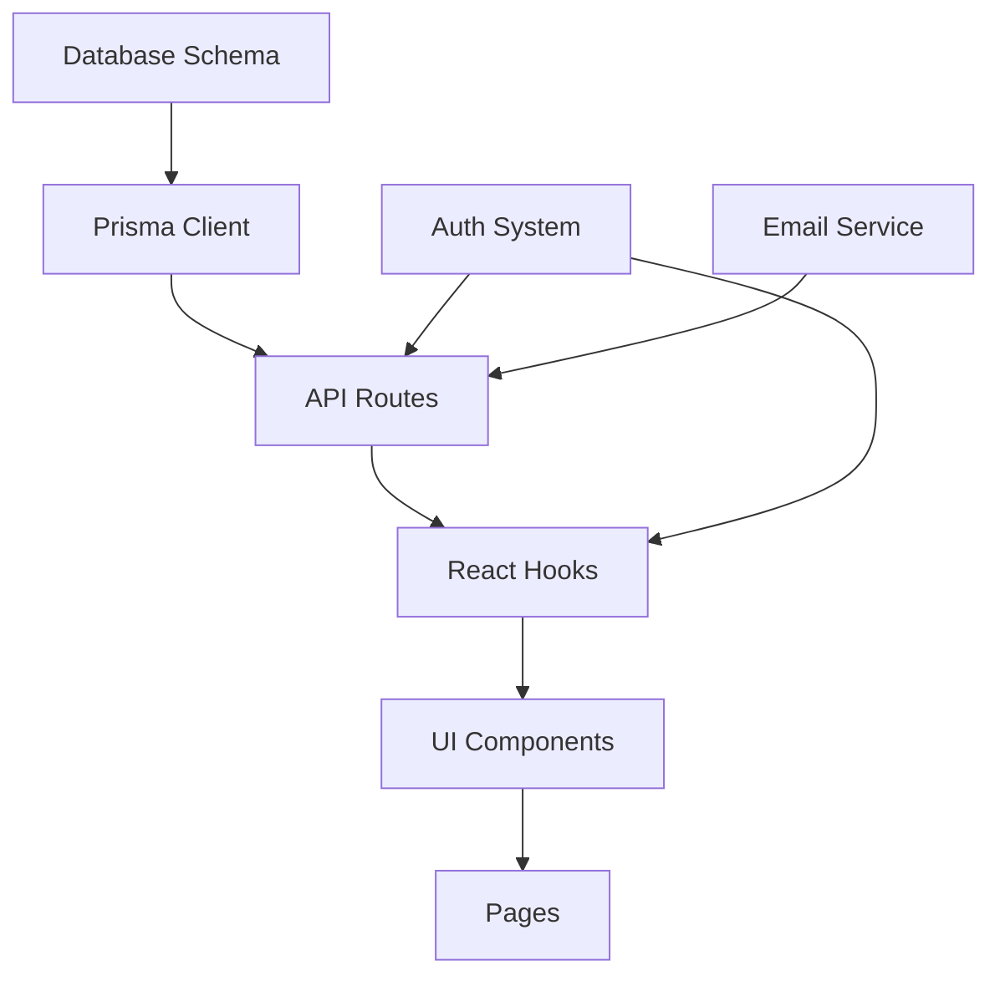

# Spec-Driven Development (Enhanced)

## Overview

Write a structured specification before writing any code. The spec is the shared source of truth between you and the human engineer — it defines what we're building, why, and how we'll know it's done. Code without a spec is guessing.

**This enhanced version adds:**
- Assumption surfacing protocol
- Drift detection mechanisms
- MoSCoW prioritization
- Constitution-based validation
- Multi-agent handoff support
- Integration with GitHub Spec Kit

## When to Use

**Always use when:**
- Starting a new project or feature
- Requirements are ambiguous or incomplete
- The change touches multiple files or modules
- You're about to make an architectural decision
- The task would take more than 30 minutes to implement
- Multiple agents will work on the same codebase

**When NOT to use:**
- Single-line fixes
- Typo corrections
- Changes where requirements are unambiguous and self-contained
- Emergency hotfixes (but document after)

## The Enhanced 4-Phase Gated Workflow

```
SPECIFY ──→ PLAN ──→ TASKS ──→ IMPLEMENT
   │          │        │          │
   ▼          ▼        ▼          ▼
 Human      Human    Human      Human
 reviews    reviews  reviews    reviews
   +          +        +          +
Validate   Detect   Prioritize  Verify
Assumptions Drift   (MoSCoW)   Against Spec
```

### Phase 1: SPECIFY - Write the Specification

#### Step 1.1: Surface Assumptions FIRST

**Before writing any spec content, list what you're assuming:**

```markdown
## ASSUMPTIONS I'M MAKING

1. This is a web application (not native mobile)
2. Authentication uses session-based cookies (not JWT)
3. The database is PostgreSQL (based on existing Prisma schema)
4. We're targeting modern browsers only (no IE11)
5. The API will be RESTful (not GraphQL)
6. Deployment target is Vercel (based on vercel.json)

→ **Correct me now or I'll proceed with these.**
```

**Why this matters:**
- Assumptions are the most dangerous form of misunderstanding
- The spec's entire purpose is to surface misunderstandings *before* code
- Silent assumptions lead to wasted implementation time

**Validation checklist:**
- [ ] Listed all technical stack assumptions
- [ ] Listed all architectural assumptions
- [ ] Listed all user/business assumptions
- [ ] Listed all deployment/infrastructure assumptions
- [ ] Asked human to confirm or correct

#### Step 1.2: Write the Core Specification

**The spec document must cover these 8 core areas:**

##### 1. Objective
What are we building and why? Who is the user? What does success look like?

**Template:**
```markdown
## Objective

**What:** [One-sentence description]

**Why:** [Business/user problem being solved]

**Who:** [Target user persona]

**Success Criteria:**
- [ ] [Specific, measurable outcome 1]
- [ ] [Specific, measurable outcome 2]
- [ ] [Specific, measurable outcome 3]

**Out of Scope:**
- [What we're explicitly NOT building]
```

##### 2. Tech Stack
Framework, language, key dependencies with versions.

**Template:**
```markdown
## Tech Stack

**Runtime:** Node.js 20.x
**Framework:** Next.js 14.2
**Language:** TypeScript 5.4
**Database:** PostgreSQL 16 (via Prisma 5.x)
**Styling:** Tailwind CSS 3.4
**Testing:** Vitest + Playwright
**Deployment:** Vercel

**Key Dependencies:**
- `next-auth@5.0` - Authentication
- `zod@3.23` - Schema validation
- `react-query@5.0` - Data fetching
```

##### 3. Commands
Full executable commands with flags, not just tool names.

**Template:**
```markdown
## Commands

**Install:**
```bash
npm install
```

**Development:**
```bash
npm run dev              # Start dev server (http://localhost:3000)
npm run dev:db           # Start local Postgres (Docker)
```

**Build:**
```bash
npm run build            # Production build
npm run build:analyze    # Build with bundle analysis
```

**Test:**
```bash
npm test                 # Run all tests
npm test -- --coverage   # With coverage report
npm run test:e2e         # End-to-end tests
npm run test:watch       # Watch mode
```

**Lint & Format:**
```bash
npm run lint             # ESLint check
npm run lint:fix         # Auto-fix issues
npm run format           # Prettier format
npm run typecheck        # TypeScript check
```

**Database:**
```bash
npm run db:migrate       # Run migrations
npm run db:seed          # Seed database
npm run db:studio        # Open Prisma Studio
npm run db:reset         # Reset database
```
```

##### 4. Project Structure
Where source code lives, where tests go, where docs belong.

**Template:**
```markdown
## Project Structure

```
project-root/
├── src/
│   ├── app/              # Next.js app directory (routes)
│   ├── components/       # React components
│   │   ├── ui/          # Reusable UI components
│   │   └── features/    # Feature-specific components
│   ├── lib/             # Shared utilities
│   │   ├── api/         # API client functions
│   │   ├── hooks/       # Custom React hooks
│   │   └── utils/       # Helper functions
│   ├── types/           # TypeScript type definitions
│   └── styles/          # Global styles
├── tests/
│   ├── unit/            # Unit tests (*.test.ts)
│   ├── integration/     # Integration tests
│   └── e2e/             # End-to-end tests (Playwright)
├── prisma/
│   ├── schema.prisma    # Database schema
│   ├── migrations/      # Migration files
│   └── seed.ts          # Seed data
├── public/              # Static assets
├── docs/                # Documentation
│   ├── SPEC.md          # This file
│   ├── API.md           # API documentation
│   └── ARCHITECTURE.md  # Architecture decisions
└── .hermes/
    └── plans/           # Implementation plans
```
```

##### 5. Code Style
One real code snippet showing your style beats three paragraphs describing it.

**Template:**
```markdown
## Code Style

**Example Component:**
```typescript
// src/components/features/UserProfile.tsx
import { useState } from 'react';
import { Button } from '@/components/ui/button';
import { useUser } from '@/lib/hooks/useUser';
import type { User } from '@/types/user';

interface UserProfileProps {
  userId: string;
  onUpdate?: (user: User) => void;
}

export function UserProfile({ userId, onUpdate }: UserProfileProps) {
  const { user, isLoading, error } = useUser(userId);
  const [isEditing, setIsEditing] = useState(false);

  if (isLoading) return <div>Loading...</div>;
  if (error) return <div>Error: {error.message}</div>;
  if (!user) return <div>User not found</div>;

  return (
    <div className="space-y-4">
      <h2 className="text-2xl font-bold">{user.name}</h2>
      <p className="text-gray-600">{user.email}</p>
      <Button onClick={() => setIsEditing(true)}>
        Edit Profile
      </Button>
    </div>
  );
}
```

**Naming Conventions:**
- Components: PascalCase (`UserProfile.tsx`)
- Hooks: camelCase with `use` prefix (`useUser.ts`)
- Utilities: camelCase (`formatDate.ts`)
- Types: PascalCase (`User`, `UserProfile`)
- Constants: UPPER_SNAKE_CASE (`MAX_RETRIES`)

**File Organization:**
- One component per file
- Co-locate tests with source (`UserProfile.test.tsx`)
- Export types from `types/` directory
- Barrel exports for public APIs (`index.ts`)
```

##### 6. Testing Strategy
What framework, where tests live, coverage expectations, which test levels for which concerns.

**Template:**
```markdown
## Testing Strategy

**Framework:** Vitest (unit/integration) + Playwright (e2e)

**Test Levels:**

1. **Unit Tests** (`tests/unit/`)
   - Pure functions and utilities
   - React hooks (with `@testing-library/react-hooks`)
   - Individual components (isolated)
   - Target: 80% coverage

2. **Integration Tests** (`tests/integration/`)
   - API routes
   - Database operations
   - Component interactions
   - Target: 70% coverage

3. **End-to-End Tests** (`tests/e2e/`)
   - Critical user flows
   - Authentication flows
   - Payment flows
   - Target: Key paths only (not coverage-driven)

**Test Naming:**
```typescript
describe('UserProfile', () => {
  it('displays user name and email', () => {
    // Arrange
    const user = { name: 'John', email: 'john@example.com' };
    
    // Act
    render(<UserProfile user={user} />);
    
    // Assert
    expect(screen.getByText('John')).toBeInTheDocument();
    expect(screen.getByText('john@example.com')).toBeInTheDocument();
  });
});
```

**Coverage Requirements:**
- Minimum: 70% overall
- Critical paths: 100%
- UI components: 80%
- Utilities: 90%
```

##### 7. Boundaries (Always/Ask First/Never)
Three-tier system for decision-making.

**Template:**
```markdown
## Boundaries

### Always Do (No Permission Needed)
- Run tests before commits
- Follow naming conventions
- Validate inputs at API boundaries
- Log errors with context
- Write tests for new features
- Update documentation when behavior changes
- Use TypeScript strict mode
- Handle loading and error states

### Ask First (Requires Approval)
- Database schema changes
- Adding new dependencies
- Changing CI/CD configuration
- Modifying authentication logic
- Changing API contracts
- Infrastructure changes
- Breaking changes to public APIs
- Performance optimizations that add complexity

### Never Do (Forbidden)
- Commit secrets or API keys
- Edit `node_modules/` or vendor directories
- Remove failing tests without fixing the code
- Push directly to `main` branch
- Disable TypeScript errors with `@ts-ignore`
- Skip tests with `.skip()` without a ticket
- Hard-code environment-specific values
- Use `any` type without justification
```

##### 8. Success Criteria (Testable Conditions)
How we'll know this is done — specific, testable conditions.

**Template:**
```markdown
## Success Criteria

**Functional:**
- [ ] User can sign up with email/password
- [ ] User receives confirmation email
- [ ] User can log in with credentials
- [ ] User can reset password via email
- [ ] User session persists across page reloads

**Non-Functional:**
- [ ] Page load time < 2s on 4G
- [ ] Lighthouse score > 90
- [ ] Zero console errors in production
- [ ] All tests passing
- [ ] Test coverage > 80%

**Documentation:**
- [ ] API endpoints documented
- [ ] README updated with setup instructions
- [ ] Architecture decisions recorded (ADRs)
- [ ] Deployment guide written

**Deployment:**
- [ ] Staging environment deployed
- [ ] Production environment deployed
- [ ] Monitoring and alerts configured
- [ ] Rollback plan documented
```

#### Step 1.3: Reframe Vague Requirements

**When receiving vague requirements, translate them into concrete conditions:**

<Bad>
```markdown
REQUIREMENT: "Make the dashboard faster"
```
</Bad>

<Good>
```markdown
REQUIREMENT: "Make the dashboard faster"

REFRAMED SUCCESS CRITERIA:
- Dashboard LCP (Largest Contentful Paint) < 2.5s on 4G connection
- Initial data load completes in < 500ms
- No layout shift during load (CLS < 0.1)
- Time to Interactive < 3.5s
- Bundle size < 200KB (gzipped)

→ Are these the right targets?
```
</Good>

**This lets you:**
- Loop and iterate toward a clear goal
- Retry and problem-solve with concrete metrics
- Avoid guessing what "faster" means

#### Step 1.4: Add MoSCoW Prioritization

**Categorize all features using MoSCoW:**

```markdown
## Feature Prioritization (MoSCoW)

### Must Have (MVP Blockers)
- User authentication (sign up, log in, log out)
- Password reset flow
- Basic profile management

### Should Have (Important but not blockers)
- Email verification
- Remember me functionality
- Profile picture upload

### Could Have (Nice to have)
- Social login (Google, GitHub)
- Two-factor authentication
- Account deletion

### Won't Have (Out of scope for this iteration)
- OAuth provider (being an OAuth server)
- SAML/SSO integration
- Biometric authentication
```

**Benefits:**
- Clear scope boundaries
- Prevents scope creep
- Enables phased delivery
- Facilitates trade-off discussions

#### Step 1.5: Validate Against Constitution (If Exists)

**If the project has a CONSTITUTION.md or PRINCIPLES.md, validate the spec against it:**

```markdown
## Constitution Validation

**Project Principles:**
1. ✅ "Security by default" - Spec includes auth, input validation, secrets management
2. ✅ "Performance matters" - Spec includes performance budgets and monitoring
3. ✅ "Accessibility first" - Spec includes WCAG requirements
4. ⚠️ "Mobile-first design" - Spec doesn't mention mobile breakpoints → NEED TO ADD
5. ✅ "Test-driven development" - Spec includes comprehensive testing strategy

**Action Items:**
- [ ] Add mobile breakpoint requirements to design section
- [ ] Add mobile-specific success criteria
```

### Phase 2: PLAN - Generate Implementation Plan

With the validated spec, generate a technical implementation plan.

#### Step 2.1: Identify Components and Dependencies

```markdown
## Implementation Plan

### Component Dependency Graph



**Implementation Order:**
1. Database schema (foundation)
2. Prisma client generation
3. Authentication system
4. API routes
5. React hooks
6. UI components
7. Pages and routing
8. Email service integration
```

#### Step 2.2: Identify Risks and Mitigations

```markdown
### Risks and Mitigations

| Risk | Impact | Probability | Mitigation |
|------|--------|-------------|------------|
| Database migration fails in production | High | Low | Test migrations on staging, have rollback plan |
| Email delivery issues | Medium | Medium | Use reliable provider (SendGrid), implement retry logic |
| Session management bugs | High | Medium | Use battle-tested library (next-auth), comprehensive testing |
| Performance degradation | Medium | Medium | Set performance budgets, monitor with Lighthouse CI |
```

#### Step 2.3: Define Verification Checkpoints

```markdown
### Verification Checkpoints

**After Database Setup:**
- [ ] Migrations run successfully
- [ ] Seed data loads
- [ ] Prisma Studio accessible

**After Auth Implementation:**
- [ ] Sign up flow works end-to-end
- [ ] Login flow works end-to-end
- [ ] Session persists across page reloads
- [ ] Password reset flow works

**After UI Implementation:**
- [ ] All components render without errors
- [ ] Responsive design works on mobile
- [ ] Accessibility audit passes (Lighthouse)
- [ ] No console errors or warnings

**Before Deployment:**
- [ ] All tests passing
- [ ] Coverage > 80%
- [ ] Lighthouse score > 90
- [ ] Security audit passes
- [ ] Performance budget met
```

### Phase 3: TASKS - Break Down into Implementable Tasks

Break the plan into discrete, implementable tasks.

#### Task Requirements
- Each task completable in a single focused session (< 2 hours)
- Each task has explicit acceptance criteria
- Each task includes a verification step
- Tasks ordered by dependency, not perceived importance
- No task should require changing more than ~5 files

#### Task Template

```markdown
## Task List

### Phase 1: Foundation

- [ ] **Task 1.1: Set up database schema**
  - **Acceptance:** Prisma schema defines User, Session, VerificationToken models
  - **Verify:** `npm run db:migrate` succeeds, Prisma Studio shows tables
  - **Files:** `prisma/schema.prisma`, `prisma/migrations/`
  - **Estimated Time:** 30 minutes

- [ ] **Task 1.2: Generate Prisma client**
  - **Acceptance:** TypeScript types available for all models
  - **Verify:** `npm run typecheck` passes, autocomplete works in IDE
  - **Files:** Generated files in `node_modules/.prisma/`
  - **Estimated Time:** 10 minutes

- [ ] **Task 1.3: Create database seed script**
  - **Acceptance:** Seed script creates test users
  - **Verify:** `npm run db:seed` succeeds, users visible in Prisma Studio
  - **Files:** `prisma/seed.ts`
  - **Estimated Time:** 20 minutes

### Phase 2: Authentication

- [ ] **Task 2.1: Install and configure next-auth**
  - **Acceptance:** next-auth configured with credentials provider
  - **Verify:** Auth API routes accessible at `/api/auth/*`
  - **Files:** `src/app/api/auth/[...nextauth]/route.ts`, `src/lib/auth.ts`
  - **Estimated Time:** 45 minutes

- [ ] **Task 2.2: Implement sign-up API route**
  - **Acceptance:** POST `/api/auth/signup` creates user, returns session
  - **Verify:** Integration test passes, user created in database
  - **Files:** `src/app/api/auth/signup/route.ts`, `tests/integration/auth.test.ts`
  - **Estimated Time:** 60 minutes

[... continue for all tasks ...]
```

#### Drift Detection Mechanism

**Add a drift detection section to track spec changes:**

```markdown
## Drift Log

**Purpose:** Track when implementation deviates from original spec

| Date | Change | Reason | Approved By |
|------|--------|--------|-------------|
| 2026-05-25 | Changed from JWT to sessions | Security recommendation | @user |
| 2026-05-26 | Added rate limiting | Production requirement | @user |
```

**When to log drift:**
- Technical approach changes
- Requirements change
- Scope changes
- Architecture decisions change

**Benefits:**
- Maintains spec as source of truth
- Documents decision history
- Enables retrospectives
- Prevents silent scope creep

### Phase 4: IMPLEMENT - Execute Tasks

Execute tasks one at a time following TDD and incremental implementation.

#### Integration with Other Skills

**Load these skills during implementation:**
- `test-driven-development` - For TDD workflow
- `incremental-implementation` - For step-by-step execution
- `context-engineering` - For loading right context at each step
- `systematic-debugging` - When issues arise

#### Multi-Agent Handoff Support

**If multiple agents will work on this codebase:**

```markdown
## Agent Handoff Protocol

**Spec Location:** `docs/SPEC.md`

**Before Starting Work:**
1. Read the spec completely
2. Check the drift log for recent changes
3. Review open tasks in the task list
4. Claim a task by adding your agent ID

**While Working:**
1. Update task status (in progress, blocked, done)
2. Log any drift immediately
3. Ask for spec clarification if ambiguous
4. Update verification checkpoints as you complete them

**After Completing Work:**
1. Mark task as done
2. Update drift log if you deviated
3. Run all verification steps
4. Update spec if behavior changed
5. Commit spec changes with code changes

**Handoff Checklist:**
- [ ] Spec is up to date
- [ ] Drift log is current
- [ ] All verification checkpoints passed
- [ ] Tests are passing
- [ ] Documentation is updated
```

## Keeping the Spec Alive

The spec is a living document, not a one-time artifact.

### When to Update the Spec

**Update immediately when:**
- Technical decisions change
- Requirements change
- Scope changes (features added/removed)
- Architecture changes
- Dependencies change
- Deployment strategy changes

**How to update:**
1. Update the relevant section
2. Add entry to drift log
3. Get human approval for significant changes
4. Commit spec changes with implementation

### Spec Maintenance Checklist

**Weekly:**
- [ ] Review drift log
- [ ] Update success criteria if needed
- [ ] Verify commands still work
- [ ] Check if dependencies need updates

**Before Major Milestones:**
- [ ] Full spec review
- [ ] Update all sections
- [ ] Verify against implementation
- [ ] Get stakeholder sign-off

**After Completion:**
- [ ] Archive spec to `docs/archive/`
- [ ] Create retrospective document
- [ ] Extract lessons learned
- [ ] Update project templates

## Integration with GitHub Spec Kit

**If using GitHub Spec Kit:**

```bash
# Install spec-kit
npm install -g @github/spec-kit

# Initialize in project
specify init --integration hermes --integration-options="--skills"

# Available commands
specify new feature-name        # Create new spec
specify validate               # Validate spec format
specify plan                   # Generate implementation plan
specify tasks                  # Generate task breakdown
specify drift                  # Show drift from spec
```

**Spec Kit adds:**
- Structured spec templates
- Validation against schema
- Automatic plan generation
- Task breakdown automation
- Drift detection tooling

## Common Rationalizations (and Rebuttals)

| Rationalization | Reality |
|---|---|
| "This is simple, I don't need a spec" | Simple tasks don't need *long* specs, but they still need acceptance criteria. A two-line spec is fine. |
| "I'll write the spec after I code it" | That's documentation, not specification. The spec's value is in forcing clarity *before* code. |
| "The spec will slow us down" | A 15-minute spec prevents hours of rework. Waterfall in 15 minutes beats debugging in 15 hours. |
| "Requirements will change anyway" | That's why the spec is a living document. An outdated spec is still better than no spec. |
| "The user knows what they want" | Even clear requests have implicit assumptions. The spec surfaces those assumptions. |
| "We're agile, we don't do specs" | Agile doesn't mean no planning. It means iterative planning. This spec supports iteration. |

## Red Flags (Stop and Fix)

**Stop immediately if you notice:**
- Starting to write code without any written requirements
- Asking "should I just start building?" before clarifying what "done" means
- Implementing features not mentioned in any spec or task list
- Making architectural decisions without documenting them
- Skipping the spec because "it's obvious what to build"
- Spec and implementation have diverged significantly
- Multiple agents working without a shared spec

## Verification Checklist

**Before proceeding to implementation, confirm:**

- [ ] The spec covers all 8 core areas (Objective, Tech Stack, Commands, Structure, Style, Testing, Boundaries, Success Criteria)
- [ ] All assumptions have been surfaced and validated
- [ ] The human has reviewed and approved the spec
- [ ] Success criteria are specific and testable
- [ ] Boundaries (Always/Ask First/Never) are defined
- [ ] MoSCoW prioritization is complete
- [ ] Implementation plan has been generated
- [ ] Tasks have been broken down
- [ ] Verification checkpoints are defined
- [ ] The spec is saved to a file in the repository (`docs/SPEC.md`)
- [ ] Drift detection mechanism is in place
- [ ] Multi-agent handoff protocol is documented (if applicable)

## Example: Complete Spec

See `references/example-spec.md` for a complete example specification following this enhanced format.

## Pitfalls

### Pitfall 1: Skipping Assumption Surfacing
**Symptom:** Implementing based on unstated assumptions, then discovering misalignment

**Solution:** Always list assumptions first, get explicit confirmation

### Pitfall 2: Spec Becomes Stale
**Symptom:** Spec and implementation diverge, spec becomes useless

**Solution:** Update spec immediately when decisions change, use drift log

### Pitfall 3: Over-Specification
**Symptom:** Spec is 50 pages, takes days to write, never gets read

**Solution:** Keep spec concise, use examples over prose, link to external docs

### Pitfall 4: Under-Specification
**Symptom:** Spec is too vague, doesn't prevent misunderstandings

**Solution:** Use the 8 core areas template, add concrete examples

### Pitfall 5: Spec as Waterfall
**Symptom:** Treating spec as unchangeable contract, resisting iteration

**Solution:** Embrace living document approach, use drift log to track evolution

## Related Skills

- `writing-plans` - For detailed implementation planning
- `test-driven-development` - For TDD workflow during implementation
- `incremental-implementation` - For step-by-step execution
- `architecture-blueprint` - For architecture decision records
- `systematic-debugging` - For troubleshooting during implementation

---

**Remember:** The spec is not bureaucracy. It's a tool to align understanding before investing time in code. A good spec saves time, prevents rework, and enables collaboration.
